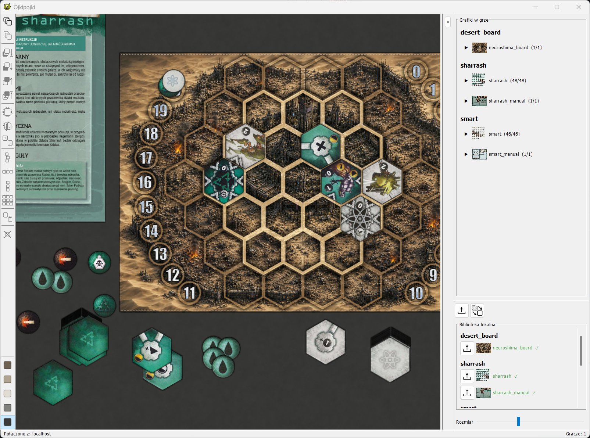

# ojkipojki



A minimalistic tabletop simulator for **Neuroshima HEX**. Official armies are not included — supply your own sprite sheets.

Client-server over TCP sockets. Server owns all mutable state; client holds a read-only mirror updated via events.

## Quick start

```sh
./gradlew run          # run locally
./gradlew release_all  # build distributable packages
```

## CLI

```
--port <int>       server port (default 12001)
--start-fresh      empty repo (no autosave)
--load-save <file> load a save file
--scenario <file>  load a scenario file
```

## Key features

- Load sprite sheets, spawn tokens, move them
- Multi-client over TCP
- Swing UI with sprite bags, token rendering (shadow/depth), animated pointers
- Auto-save, load/save scenarios
- Distributable via jpackage (Windows zip, Linux deb/rpm, macOS dmg)

## Build

```sh
./gradlew test     # tests required for new commands/events/handlers
./gradlew run      # copies local_resources/ → last_run_tmp/
./gradlew release_all
```
